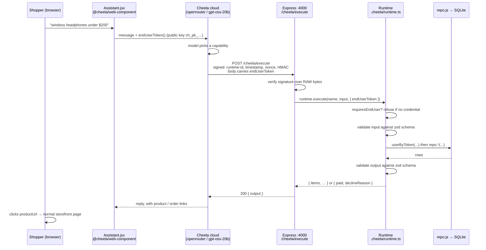
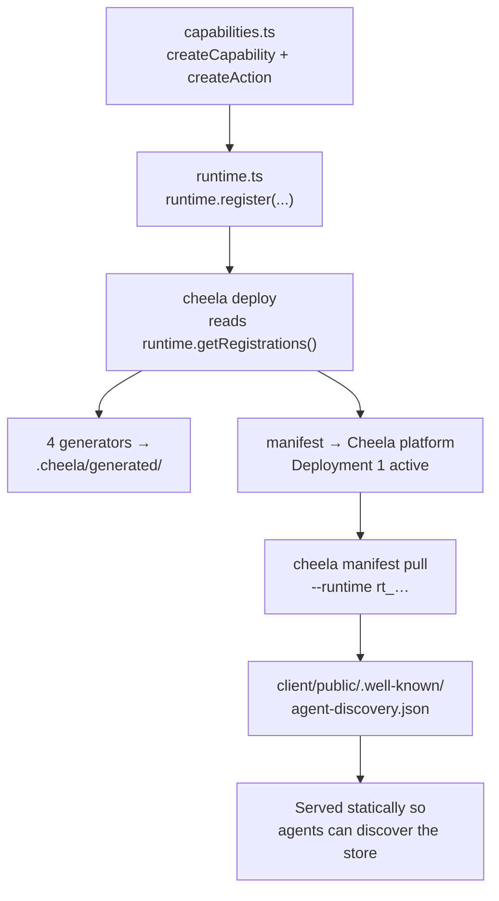
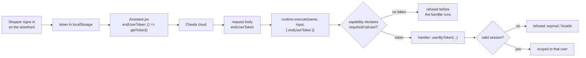
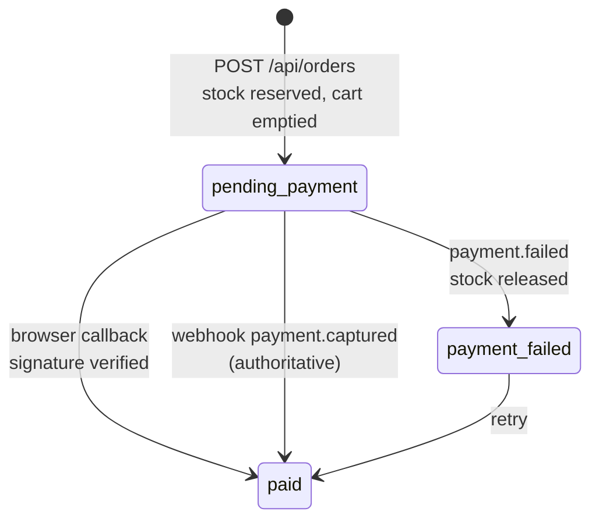

# Integration guide — how this project fits together

How this project fits together: every file, where it lives, and why. Written to
explain the **Cheela integration flow** end to end, with enough of the storefront
underneath it that the integration makes sense.

Two independent things are going on:

1. **A storefront** — React + Express + SQLite. Works entirely on its own.
2. **A Cheela runtime** — exposes that storefront's operations as capabilities an
   agent can invoke.

The integration is deliberately *additive*: delete `server/.cheela/`, the
`/cheela/execute` mount and `Assistant.jsx`, and the shop still runs unchanged.

---

## 1. The mental model

The single idea worth internalising:

> **Cheela calls into your server. Your server does not call Cheela.**

The chat widget in the browser talks to Cheela's cloud. Cheela's cloud runs the
model, decides which capability to invoke, and then makes a **signed HTTPS request
back into your Express server**. Your capability code runs on your own machine,
against your own database, and returns JSON.

That single fact explains nearly every design decision below: why the runtime lives
on the server and not in React, why a public HTTPS endpoint (or tunnel) is required,
why there is an HMAC secret, and why the raw request body matters.

---

## 2. Runtime flow — what happens when a shopper asks for something



**Why each hop exists**

| Hop | Why |
| --- | --- |
| Widget → Cheela cloud | The model runs on Cheela's side; the browser never sees a model key. Only the **public** key `ch_pk_…` is embedded. |
| Cheela → your server | Your data never leaves your box. Cheela sends *which* capability to run, not the data. |
| Signature verification | The endpoint is public HTTPS. Without verification, anyone who found the URL could place orders. |
| End-user token | Proves *which shopper* this is. The signature proves the call came from Cheela; it says nothing about who is asking. Both are needed. |
| Schema validation | The runtime validates **both** input and output, so a model hallucinating a field fails loudly instead of corrupting a cart. |

---

## 3. Deploy flow — how capabilities reach the platform

Cheela has to know what your capabilities *are* before the model can call them.
That is what `cheela deploy` does. It never uploads your handler code — only the
declarative metadata (names, descriptions, JSON Schemas).



**Discovery is by registration, not by file scanning.** The CLI calls
`runtime.getRegistrations()`. A capability that is defined but never `register()`ed
in `runtime.ts` simply does not exist as far as the platform is concerned. There is
no second manifest to keep in sync — which is the whole point.

---

## 4. Authentication — how a capability knows who is asking

The signature proves a call came *from Cheela*. It says nothing about *which
shopper* is asking. Those are two different questions, and order capabilities need
both answered.



**Two layers, deliberately.** The platform checks a credential *exists*
(`requiresEndUser`). Only your code can check it is still *valid* — expiry,
revocation — which is what `requireShopper()` in `capabilities.ts` does. Relying on
the platform alone would accept a token that was revoked an hour ago.

`endUserToken` is passed as a **function**, not a string. A shopper can sign in long
after the widget mounted, and a value read once would pin whatever was true then.

### What is gated, and what that buys

| Capability | Gated | Why |
| --- | --- | --- |
| `catalog-*`, `cart-*`, `store-*` | no | A visitor can browse and fill a cart without an account, exactly as in the UI |
| `checkout-place-order` | yes | Orders belong to someone |
| `checkout-pay-order` | yes | Money |
| `orders-get-order`, `orders-list` | yes | Someone else's purchase history |

Three properties, each covered by a test in `cheela-smoke.mjs`:

- **Ownership comes from the credential, never the input.** `checkout-place-order`
  takes no user id — it files the order against the token's user. An agent cannot
  place an order on somebody else's account even if it tries.
- **Cross-account access fails identically to "not found".** Reading or paying
  another shopper's order gives the same message as a nonexistent order number,
  so an agent cannot probe for which orders exist.
- **No sign-in capability exists.** Authenticating through a capability would put a
  password through the model. Shoppers sign in on the storefront; the widget passes
  the resulting token down.

---

## 5. The payment flow

Payments go through **Razorpay**. An order and its payment are separate objects,
and the shop can settle one two independent ways.



**Why an order and its payment are separate.** Placing reserves stock; paying
settles it. Reserving at placement stops two shoppers both checking out the last
unit and then racing at the card step. Releasing on failure stops a dead order
holding inventory hostage.

**Why both a callback and a webhook.** The browser callback carries
`razorpay_payment_id`, `razorpay_order_id` and `razorpay_signature` — but it
arrives through the shopper's own browser, so those values are attacker-supplied
until the HMAC over `order_id|payment_id` checks out. And a shopper who pays and
then closes the tab never runs the callback at all; their money has still moved.
The webhook is the only path that completes those orders, which makes it
authoritative rather than a backup. Both funnel into the same idempotent
`settleRazorpayPayment`, so whichever lands first wins and the second is a no-op.

**Amounts are re-checked on both paths.** A verified signature proves *who* sent
the message, not *how much* was paid — an underpayment is still an underpayment,
so the amount is compared against the order total before anything is marked paid.

**Why the webhook is mounted on the raw body.** Its signature is an HMAC over the
exact bytes Razorpay sent. `express.json()` consumes the stream, and
re-serialising the parsed object yields different bytes, so every signature would
fail. Same reason as `/cheela/execute`.

### The simulated processor

`server/src/mock-payments.js` still exists and takes over whenever Razorpay is
unconfigured, so a clean clone checks out and every test passes with no account.
The outcome is decided by an opaque method token — never a card number — which
keeps success, decline, insufficient funds and expiry reproducible.

| Token | Outcome |
| --- | --- |
| `pm_card_visa`, `pm_card_mastercard` | succeeds |
| `pm_card_declined` | `card_declined` |
| `pm_card_insufficient_funds` | `insufficient_funds` |
| `pm_card_expired` | `expired_card` |

An unrecognised token is a **400 that leaves the order untouched**, not a decline:
a typo is a caller error, not an issuer decision, and treating it as a decline
would mark the order failed and release its stock over a spelling mistake.

### Sandbox mode

`RAZORPAY_SIMULATE=1` runs the Razorpay flow with the wire cut — for when an
account's business details are not yet approved and every real payment fails for
reasons unrelated to this code. `createOrder`, `createPaymentLink` and
`fetchPayment` return the shapes Razorpay would; **signing and verification are
not stubbed**, so the code that decides whether an order is paid is the code that
runs in production. The outcome is encoded in the payment id, the same way the
simulated processor encodes it in a token. Enabling it with `NODE_ENV=production`
throws at startup.

## 6. What the integration is made of

### 6.1 The Cheela integration

| File | Why it exists |
| --- | --- |
| **`server/.cheela/capabilities.ts`** (854 lines) | **The heart of the integration.** All 15 capabilities: zod input/output schemas, descriptions the model reads, `requiresEndUser` on the five order and address capabilities, and handlers that call `repo.js`. Also holds `defineCapability()`, `requireShopper()` and a typed facade over `repo.js` (plain JS) so this file type-checks on its own terms. |
| **`server/.cheela/runtime.ts`** (25) | Creates the `Runtime`, grants the `cart:write` / `orders:write` permissions, and registers every capability. This is the file the CLI loads to discover what to deploy. |
| **`server/cheela.config.ts`** (34) | Deploy config: API key (from env), ADP namespace, website metadata, and a conditionally-set endpoint. Scaffolded by `cheela init` — the 0.7 template still omits `provider`/`model`, which live on the dashboard. |
| **`server/tsconfig.json`** (24) | The `.cheela` files are TypeScript. Node strips types natively at runtime, so this exists purely so the IDE and `npm run typecheck` agree. Needs `allowImportingTsExtensions` because Node requires the real `.ts` extension on imports, and `checkJs: false` so the plain-JS storefront resolves without being type-checked. |
| **`client/src/components/Assistant.jsx`** (457) | The shopper-facing chat panel, behind a floating launcher. The transcript, composer and status are this project's own React and CSS; the conversation underneath them is `getSession` from `@cheela/web-component/headless`, and message bodies are built by that package's `renderMarkdown` / `renderActions` — see §14. Passes `endUserToken` as a function so a later sign-in is picked up. Renders **only** if `VITE_CHEELA_PUBLIC_KEY` is set. Replies stream in token by token. |
| **`client/public/.well-known/agent-discovery.json`** (2063) | The published manifest, fetched by `cheela manifest pull`. Served as a static asset so external agents can discover the store. Committed, because a static host will not run the CLI. |
| **`scripts/cheela-smoke.mjs`** (187) | 39-check test driving the capabilities as an agent would, including the auth boundary (no token, bad token, another shopper's order) and the full pay/decline/retry cycle. Runs the runtime in-process — no server, no API key — yet proves every schema, because `execute()` validates both directions. |
| **`server/src/razorpay.js`** | The gateway: Orders, Payment Links, `fetchPayment`, and the two signature verifications. Talks to Razorpay over `fetch` rather than the SDK so the HMAC arithmetic — the part that decides whether money moved — is visible here rather than buried in a dependency. Also holds sandbox mode. |
| **`server/src/webhooks.js`** | The signed webhook router, mounted on a raw body. Status codes are chosen for what they make Razorpay *do*: 401 on a bad signature (no retry wanted), 200 on an unknown order (retrying will not make it exist), 500 on a handler error (so the payment is not lost). |
| **`client/src/pages/Pay.jsx`** | The hosted page an agent's payment link lands on. Reachable without signing in — a payment link is a bearer capability for one order, like an emailed invoice — and shows only the order number and what is owed. |
| **`client/src/components/AddressForm.jsx`** | The address form shared by checkout and the account page, so the two cannot drift into accepting different things. Indian shape; the server re-validates the same rules. |
| **`scripts/shared-cart-smoke.mjs`** | 13 checks that the assistant and the browser tab operate on one cart, including that an empty stale `cartId` cannot divert a signed-in shopper and a filled guest cart is adopted. |
| **`scripts/actions-smoke.mjs`** | 11 checks running real capability output through `extractActions` — what the panel would actually render — and asserting `http:` and `javascript:` URLs are dropped. |
| **`scripts/razorpay-smoke.mjs`** / **`razorpay-sandbox.mjs`** | 36 checks across signature tampering, idempotent settlement, underpayment refusal and sandbox pass/fail. Neither needs a Razorpay account. |
| **`server/.env`** | 🔒 Git-ignored. Holds the real `ch_sk_…` deploy key. The CLI reads this automatically. |
| **`server/.env.example`** | Committed template, key redacted. |
| **`server/src/mock-payments.js`** (108) | The simulated processor: method tokens, test-card mapping, and the outcome table. No network, no real card. |
| **`client/.env`** / **`.env.example`** | Browser config, kept separate because **anything here ships in the JS bundle** — so it only ever holds the public key. |

### 6.2 Files modified to wire it in

| File | The change |
| --- | --- |
| **`server/src/index.js`** | Mounts `POST /cheela/execute` with `express.raw()` **before** `express.json()`; returns 503 when the secret is unset; excludes `/cheela` from the SPA catch-all; reports capability + gated counts at boot. |
| **`server/src/db.js`** | Added the `payments` table. |
| **`server/src/repo.js`** | Order status lifecycle, `payOrder` / `capturePayment` / `failPayment`, stock release on decline. The one implementation both REST and capabilities call. |
| **`server/src/seed.js`** | Seeds the demo account and its fixed session token. |
| **`server/src/routes.js`** | `POST /orders/:id/pay` and `GET /payment-methods`. |
| **`server/src/auth.js`** | `userByToken()` — resolves a token held directly, rather than an `Authorization` header, which is the shape a capability gets. |
| **`client/src/pages/Checkout.jsx`** | Split into place-then-pay, with a `PaymentStep` card form. |
| **`client/src/api.js`** | `pay()` / `paymentMethods()`, and `allowStatuses` so a 402 decline resolves rather than throws. |
| **`client/src/components/Layout.jsx`** | Renders `<Assistant />` on every page. |
| **`client/src/styles.css`** | The `.assistant-launcher` / `.assistant-panel` block, and the `.chat-*` block under it — transcript, bubbles, markdown, composer and the action buttons. That second half used to be a stylesheet shipped by `@cheela/ui`; §14 covers why it is written out here now. |
| **`.gitignore`** | Root ignores `.env` and explicitly **un-ignores** `.env.example`; `server/.gitignore` (from `cheela init`) covers the CLI's generated output and cache. |
| **`package.json`** (root + workspaces) | Scripts for dev/deploy/status/manifest/typecheck, and `--env-file-if-exists=.env` on the server scripts. |

### 6.3 The storefront underneath (built before Cheela)

**Backend — `server/src/`**

| File | Why |
| --- | --- |
| `db.js` (146) | SQLite schema + connection via `node:sqlite` (built into Node — no native module to compile). Tables for products, images, carts, orders, users, sessions. |
| `svg.js` (307) | The 14 hand-drawn product illustrations, as code. |
| `products.js` (303) | The 16-product catalogue seed data. |
| `seed.js` (131) | The image pipeline: draw SVG → rasterise to PNG at 3 widths (sharp) → store bytes as BLOBs. Hash-checked so it only re-renders when art changes. |
| `repo.js` (326) | **All queries.** The single source of truth for cart totals, stock rules and order transactions — which is exactly why the capabilities call it directly rather than re-implementing anything. |
| `auth.js` (108) | scrypt password hashing + revocable bearer sessions. |
| `routes.js` (177) | The REST API the React app uses. |
| `index.js` (81) | Express app assembly. |

**Frontend — `client/src/`**

| File | Why |
| --- | --- |
| `main.jsx`, `App.jsx` | Entry point and routes. |
| `api.js` (74) | `fetch` wrapper + money formatting. |
| `store.jsx` (130) | Cart + auth context. The cart lives server-side; only its id is in `localStorage`. |
| `styles.css` (365) | All styling — no CSS framework. |
| `components/` | `Layout`, `ProductCard`, `Icons` (inline SVG), `Assistant`. |
| `pages/` | `Home`, `Catalog`, `Product`, `Cart`, `Checkout`, `Order`, `Login`, `Account`. |
| `public/logo.svg` | Favicon, generated from the same SVG code as the product art. |

**Other:** `scripts/smoke.mjs` (38-check REST API test), `client/index.html`,
`client/vite.config.js` (proxies `/api` → :4000), `README.md`.

### 6.4 Not hand-written

- `server/.cheela/generated/**` and `generate.cache.json` — written by `cheela deploy`.
  Git-ignored; regenerated on demand.
- `server/.gitignore` — written by `cheela init`, which appends `.env` and
  `.cheela/generate.cache.json` to whatever it finds. `.cheela/generated/` is added
  on top by hand. `client/.gitignore` now only carries its `.env` line; the stale
  `.cheela/` entry left by the original `cheela init` in `client/` is gone.
- `node_modules/`, `package-lock.json`, `.claude/settings.local.json`.

---

## 7. Configuration and secrets

Two `.env` files, deliberately. The split is a security boundary, not tidiness.

| Where | Variable | Secret? | Used by |
| --- | --- | --- | --- |
| `server/.env` | `CHEELA_API_KEY` (`ch_sk_…`) | 🔒 **Yes** | `cheela deploy`, `cheela status` |
| `server/.env` | `CHEELA_RUNTIME_SECRET` | 🔒 **Yes** | Verifying the HMAC on incoming calls |
| `server/.env` | `CHEELA_RUNTIME_ID` | No | Rejecting signatures meant for another runtime |
| `server/.env` | `CHEELA_ENDPOINT` | No | The public URL Cheela calls back on |
| `server/.env` | `PUBLIC_BASE_URL`, `STOREFRONT_URL` | No | Building image and CTA links in results |
| `client/.env` | `VITE_CHEELA_PUBLIC_KEY` (`ch_pk_…`) | No | The chat widget |

**Anything in `client/.env` is compiled into the JavaScript the user downloads.** A
`ch_sk_` key placed there would be readable by every visitor. That is the entire
reason the files are separate.

The CLI loads `server/.env` by itself. The Express scripts use
`node --env-file-if-exists=.env` so the app and the CLI read the same file.

**Current state:** the deploy key is configured and working.
`CHEELA_RUNTIME_SECRET` is intentionally **blank** — it is shown only once at
registration, so paste it in yourself. Until then `/cheela/execute` returns 503
rather than trusting unsigned requests. It fails closed on purpose.

---

## 8. Why the code looks the way it does

Five constraints that are non-obvious and will bite if changed:

**1. Capability names are hyphen-only.** `cart-add-item`, never `cart.add_item`.
LLM tool-calling APIs reject dots outright — a name the model cannot emit can never
be invoked — and the Agent Discovery Specification rejects underscores. Hyphens are
the only character satisfying both. The dots ADS wants come from `adp.namespace`,
producing `com.example.cheelashop.cart-add-item`. `cheela-smoke.mjs` asserts this
against the SDK's own validator so it cannot silently regress.

**2. The handler is mounted before `express.json()`.** The signature is an HMAC over
the *exact bytes received*. `express.json()` consumes the stream and re-serialising
the parsed object produces different bytes — key order, whitespace — so every
signature would fail. Hence `express.raw({ type: '*/*' })`.

**3. The runtime is in `server/`, not `client/`.** `cheela init` scaffolds wherever
you run it, and it was first run in `client/`. But capability calls arrive over
HTTPS and must land on Express; Vite cannot serve them in production. Putting the
runtime on the server also lets capabilities call `repo.js` directly — no self-HTTP
hop, and cart/stock/order logic stays in one place.

**4. `endpoint` is only sent when `CHEELA_ENDPOINT` is set.** Your dashboard already
holds a working endpoint. Deploying a placeholder would overwrite it with a dead
URL and silently break the runtime.

**5. There is no sign-in capability.** Authenticating through a capability means
putting a password through the model. Shoppers sign in on the storefront and the
widget passes the resulting token down as `endUserToken`.

**6. Placing and paying are separate capabilities.** A single "buy this" call would
have to both reserve stock and take money in one step, which leaves no state for the
model to reason about when a card is declined. Splitting them means a decline is a
recoverable position — the order still exists, and `checkout-pay-order` can be
retried with another method.

Also worth knowing: **provider and model are not in `cheela.config.ts`.** As of CLI
0.5 they live on the dashboard's Provider & endpoint card. `cheela status` reports
which are in force — currently openrouter / `openai/gpt-oss-20b:free`.

### What the 0.7 build changed here

Current versions: `@cheela/cli@0.9.0`, `@cheela/{runtime,sdk}@0.7.0`,
`@cheela/web-component@0.3.0`, `@cheela/client@0.5.0` (see §12 for what the
browser side brought, and §14 for why the widget package is the web-component
one rather than `@cheela/ui`). Three things mattered on the 0.7 core:

**1. `createCapability` is generic, and it is the reason this file shrank in
concept if not in lines.** In 0.6 it returned `Capability<unknown, unknown>`, so
every handler had to restate its own input shape as a type annotation —
`handler: (_ctx: ActionContext, input: { cartId: string }) => …` — a cast the API
gave you no way to avoid, and a second place for the schema to drift. In 0.7 the
zod schemas flow through to the handler, so the annotations are gone and **both
directions are checked at compile time**:

```
input.cartIdTypo  →  Property 'cartIdTypo' does not exist on type '{ cartId: string; }'
total: String(x)  →  Action<…> is not assignable to Action<…>
```

Under 0.6 both were `unknown` and survived until `execute()` validated them at
runtime. `defineCapability()` at the top of `capabilities.ts` exists to make that
inference reachable: pairing the capability and action in one call is what lets
TypeScript infer from the schemas and contextually type the handler.

**2. The SDK dropped `CAPABILITY_NAME_PATTERN`, `suggestCapabilityName`,
`createPermission`, the `Permission` type and `RuntimeError`.** Nothing here
imported them, so the upgrade was a no-op — but a project that did will not
compile. `isValidCapabilityName` and `describeCapabilityNameError` survive.

**3. `Runtime.execute()` accepts Cheela's `executionId`.** The Express handler
forwards it, so a handler that logs it can be joined to the trace in the
dashboard instead of minting an unrelated id.

What did **not** change: the four generated artifacts are byte-identical to the
0.6 output apart from their timestamps, and the published ADP manifest is
unchanged. Upgrading did not alter what agents see.

### CLI 0.9.0

There is no 0.8.0 — the CLI went 0.7.0 → 0.9.0. Its **public type surface is
identical**, and the whole behavioural diff is one thing:

**`CHEELA_API_URL` is gone.** 0.7.0 resolved the control-plane base URL as
`options.baseUrl ?? process.env.CHEELA_API_URL ?? "https://api.cheelalabs.com/"`;
0.9.0 drops the env var, hardcoding the default. The matching
"Check CHEELA_API_URL and your network connection" error text and the
`# Optional: CHEELA_API_URL=http://localhost:3000` line in the generated
`.env.example` went with it. Pointing the CLI at a local control plane now
requires passing `baseUrl` programmatically.

Nothing else moved: same generators, same config schema, same commands, same
deployment manifest. This project never set `CHEELA_API_URL`, so the upgrade is
a no-op here.

---

## 9. Commands

```bash
npm run dev                 # storefront: :5173 (UI) + :4000 (API)

npm run smoke               # 48 — REST API incl. payments (needs the server)
npm run smoke:cheela        # 35 — capabilities, auth and payment, in-process
npm run smoke:cart          # 13 — assistant and browser share one cart
npm run smoke:actions       # 11 — the pay button renders
npm run smoke:addresses     # 17 — address book and isolation
npm run smoke:sandbox       # 16 — payment pass/fail, no network
npm run smoke:razorpay      # 20 — signatures and webhooks
npm run typecheck           # the .cheela TypeScript

npm run cheela:dev          # list what the runtime would deploy, ship nothing
npm run cheela:status       # what the platform currently holds
npm run cheela:deploy:dry   # validate + generate, ship nothing
npm run cheela:deploy       # publish the capability set

# refresh the served discovery manifest after a deploy (run in client/)
cd client && npx cheela manifest pull --runtime rt_23fc70839a4b02f45b91ae6c9794f8e1
```

**Current deployment**

```
Runtime        rt_23fc70839a4b02f45b91ae6c9794f8e1
Deployment     7 — active
Connection     online (Signed HTTPS)
Provider       openrouter / openai/gpt-oss-20b:free
Capabilities   15, in sync (5 require a signed-in shopper)
Endpoint       https://<quick-tunnel>.trycloudflare.com/cheela/execute
```

The endpoint is a **cloudflared quick tunnel**, which gets a fresh hostname every
time it starts. Restarting it means updating `CHEELA_ENDPOINT` and redeploying,
because the platform stores the URL rather than resolving it.

**One gap worth knowing.** `requiresEndUser` reaches the *generated* capability
manifest (`.cheela/generated/capability-manifest/capabilities.json`) and, as of CLI
0.7, is a declared field on the deployment manifest sent to the control plane. It
still does **not** appear in the published ADP document that
`cheela manifest pull` returns — checked against the live manifest on 0.7 — so an
agent discovering the store externally cannot see which capabilities need a
credential until a call fails. That is a platform limitation, not a setting. The
mitigation is in the descriptions: each gated capability says "Requires a signed-in
shopper" in prose, and descriptions *are* published.

---

## 10. To take this live

1. **Paste `CHEELA_RUNTIME_SECRET`** into `server/.env` — until then the endpoint 503s.
2. **Expose the endpoint.** Cheela calls in, so `localhost` is unreachable. Tunnel it
   (`ngrok http 4000`), set `CHEELA_ENDPOINT` to `https://…/cheela/execute`, redeploy.
3. **Set `VITE_CHEELA_PUBLIC_KEY`** in `client/.env` to make the chat widget appear.
4. **Change the ADP namespace.** It is still the placeholder `com.example.cheelashop`
   and is baked into every published capability name — use your real domain before
   this is public, then redeploy and re-pull the manifest.
5. **Remove the demo account.** Set `DEMO_ACCOUNT=off`. Its session token is fixed
   and documented, which is fine for a demo and unacceptable anywhere real.
6. **Replace the mock processor.** `server/src/mock-payments.js` is the only thing
   standing in for a payment provider; `repo.payOrder` is the seam to swap.

---

## 11. Known upstream issue: the chat widget and `fetch`

**Symptom.** Every message in the assistant fails immediately with
*"Could not reach the Cheela API. Check the network connection and baseUrl."* —
even though the API is reachable, CORS is correct, and the key is valid.

**Still present on 0.5.0**, the version `@cheela/web-component@0.3.0` pins
*exactly* — so replacing `@cheela/ui` (§14) did not replace the bug. Re-checked
at that release: the constructor is byte-for-byte the same as 0.2.0's, and the
new entry point does not help, because `createChatController` builds the client
itself —

```js
new ExecutionClient({ apiKey, baseUrl, ...(cfg.endUserToken ? { endUserToken: cfg.endUserToken } : {}) })
```

— and `ControllerConfig` has no `fetchImpl` field to pass through. There is
still nowhere to inject a bound copy. Re-check on the next release.

**Cause.** `@cheela/client@0.2.0` stores the global fetch on its instance and
then calls it as a method:

```js
this.fetchImpl = options.fetchImpl ?? fetch;   // constructor
response = await this.fetchImpl(url, init);    // execute()
```

That rebinds `this` from `window` to the client, and browsers reject it:

```
TypeError: Failed to execute 'fetch' on 'Window': Illegal invocation
```

The client catches everything around that call and rethrows it as
`CheelaNetworkError`, so the message points at DNS and CORS when the network was
never involved. It fails for every message, in every browser, whatever the
configuration.

**Fix here.** With no seam to inject through, `Assistant.jsx` binds the global
once at module load. This is semantically inert — `fetch` is specified to work
with any receiver — and should be removed once upstream binds its own reference.

The same wrapper rescues a second silent failure: when the platform cannot
invoke a capability it answers **HTTP 200** with `{ status: "failed", error }`.
Nothing throws, the reply carries no assistant text, and the shopper is left
looking at their own message. The wrapper turns that into a rejection so the
panel's error path can explain it.

**Verify the transport independently of the widget:**

```js
await fetch('https://api.cheelalabs.com/v1/runtime/execute', {
  method: 'POST',
  headers: { Authorization: 'Bearer ch_pk_…', 'Content-Type': 'application/json' },
  body: JSON.stringify({ messages: [{ role: 'user', parts: [{ type: 'text', content: 'hi' }] }] }),
}).then(r => r.json());
```

A 401 means the public key is wrong. A 200 with `status: "failed"` and
*"has no HTTPS endpoint configured"* means the transport is fine and the runtime
simply has nowhere to be called back on — see below.

---

## 12. Streaming, and the override that enables it

**Symptom.** The assistant's reply appears all at once after a long pause,
rather than filling in word by word.

**Cause.** Nothing to do with the runtime — the platform has always streamed.
`POST /v1/runtime/execute` with `Accept: text/event-stream` returns
`content-type: text/event-stream` and token-level `event: text` frames. But
`@cheela/client@0.2.0` contains **no streaming code at all** — no
`executeStream`, no `Accept: text/event-stream`, nothing — and
`@cheela/ui@0.1.1` pins that version *exactly*.

**Fix.** Streaming arrived in `@cheela/client@0.3.0` via `executeStream()`, and —
the part that matters — its `ConversationStore.sendMessage` consumes it
internally, pushing a state update per token. `ConversationStore` is what every
embedding surface drives, `@cheela/web-component`'s controller included, and its
public API has not changed since 0.2.0, so a newer client streams with **no UI
code change**.

**`@cheela/web-component@0.3.0` depends on `@cheela/client@0.5.0` directly, so
nothing special is needed — just install it.** An earlier revision of this
project forced a newer client under an older widget package with a root
`overrides` entry; that is gone, and should not be reintroduced. If you ever do
need it again, note that npm only honours `overrides` in the **workspace root**,
a stale `node_modules` ignores the change entirely (only
`rm -rf node_modules package-lock.json && npm install` applies it), and it never
appears in `package-lock.json` — so confirm with the installed version rather
than the lockfile:

```bash
node -p "require('./node_modules/@cheela/client/package.json').version"
```

Verified by driving `ConversationStore` directly against the live API on 0.4.0:
**20** incremental state updates, the reply growing 3 → 66 characters. On 0.2.0
that is a single update.

**The fetch wrapper had to learn about SSE.** `Assistant.jsx` inspects
execute responses with `await response.clone().json()` to catch the
HTTP-200-with-`status: "failed"` case. On a streaming body `.json()` does not
reject until the stream *ends*, so awaiting it held the response back until the
reply was complete — defeating the streaming it was meant to coexist with. It
now returns immediately for `text/event-stream`.

**One consequence to be aware of.** That silent-failure guard therefore no
longer covers the streaming path, and `ConversationStore.sendMessage` ignores
`result.status` on the `done` event. So a platform-side failure — the 408 in §13,
for instance — reaches the panel as an ordinary, successful-looking turn.

`Assistant.jsx` now catches **half** of that from the outside. When a turn
settles back to `idle` and the transcript still ends on the shopper's own
message, there was no reply at all, and the panel says so instead of leaving the
message sitting there. Be clear about the half it does not catch: if the model
emitted any prose before the capability failed, the turn ends on an assistant
message and the guard stays quiet. That is not hypothetical — it is what a dead
tunnel looks like here, a cheerful *"Let me search for wireless headphones under
₹20,000 for you."* and then nothing, with no error anywhere in the panel or the
console.

Fixing the other half needs the `error` field on the `capability_end` event, and
`ConversationStore` neither exposes it nor surfaces `result.status`. A panel that
wanted it would have to drive `ExecutionClient.executeStream()` directly and keep
its own transcript — which is the trade §14 declined to make.

---

## 13. The endpoint is not optional

Cheela calls *in*. Until the runtime has a public HTTPS endpoint, the model picks
a capability and then the platform fails with:

```
Runtime rt_… has no HTTPS endpoint configured
```

which is what the assistant surfaces as *"not connected to the store"*. Browsing,
the REST API and the capability code are all fine — there is simply no route from
Cheela back to this machine.

```bash
# 1. expose the local server
npx cloudflared tunnel --url http://localhost:4000

# 2. point the runtime at it (server/.env)
CHEELA_ENDPOINT=https://<subdomain>.trycloudflare.com/cheela/execute
CHEELA_RUNTIME_SECRET=<the secret shown once at registration>

# 3. republish
npm run cheela:deploy
```

**Use cloudflared, not localtunnel.** Measured here on the same server:
localtunnel answered in **9.6s**, cloudflared in **0.84s**. Cheela gives up well
before 9s and reports the capability call as

```
Runtime unreachable while calling "catalog-search-products":
Runtime HTTP transport failed with status 408
```

which reads like a broken integration but is purely tunnel latency — signed
requests sent by hand over that same localtunnel succeeded. localtunnel also
dropped its process unprompted mid-session, turning the 408s into 502s. Neither
failure says anything about the runtime.

`CHEELA_RUNTIME_SECRET` matters just as much: without it `/cheela/execute` answers
503 rather than trusting unsigned requests, so Cheela would reach the server and
still be turned away.

---

## 14. The chat panel is this project's own

The panel used to be `<CheelaProvider>` + `<Chat/>` from `@cheela/ui`, plus that
package's stylesheet. It is now this project's own React and CSS, built on
`@cheela/web-component`. Nothing about the integration changed — same public key,
same `endUserToken`, same capabilities, same wire format. Only the browser-side
rendering moved.

### Why not the drop-in element

`@cheela/web-component` ships `<cheela-chat api-key="…">`, which is genuinely one
line. It renders into an **open shadow root** so the host page's CSS cannot reach
in — exactly right when you are embedding into a site you do not control, and
exactly wrong here, where the widget *is* the site and has to match a storefront
that already has a type scale, a radius and a brand colour. Custom properties
pierce the boundary, but only for the values the package chose to expose; the
bubble layout, the composer and the empty state are not among them.

### What is borrowed and what is written here

The package's real seam for this is its `/headless` entry point, described in its
own source as "the piece to reach for when you have your own design system":

```js
import { DEFAULT_SESSION, getSession, renderMarkdown, renderActions }
  from '@cheela/web-component/headless';
```

| Borrowed | Written here |
| --- | --- |
| `getSession` — the conversation: HTTP client, transcript, request lifecycle, streaming | The panel, launcher, transcript layout, bubbles, composer, empty state, thinking indicator, error banner |
| `renderMarkdown` — model prose → DOM | Every `.chat-*` rule in `styles.css` |
| `renderActions` — capability actions → buttons | The stall guard (§12), the `explain()` error mapping, the per-turn cart refresh |

The split is not arbitrary. The two borrowed renderers are the ones where a
mistake is a security bug rather than a cosmetic one, and both are inside the
blast radius of content this shop does not author:

- `renderMarkdown` walks the parsed tree building DOM nodes, so no markup string
  is ever assembled — there is no `innerHTML` in the transcript and no sanitiser
  to keep ahead of.
- `renderActions` drops any action URL that is not `https:`. That is what stops
  `javascript:` in a capability's output from becoming stored XSS on this domain
  against this shop's own customers. `scripts/actions-smoke.mjs` asserts it from
  the runtime side; the panel gets the same rule for free by not re-deriving it.

Both hand back detached DOM rather than React elements, so `Bubble` attaches them
in an effect. They are rebuilt on every run rather than memoised: a
`DocumentFragment` is emptied by the insertion, so re-using a previous one would
blank the message — which is precisely what StrictMode's second effect pass would
otherwise do.

### Two things worth knowing about the controller

**`getSession`, not `createChatController`.** `getSession` keys the controller by
name at module scope, so the conversation outlives the component — including
StrictMode's deliberate mount/unmount/remount in development. Nothing calls
`destroySession`: `destroy()` detaches the controller from its store permanently,
so a remount would find a session that never updates again.

**`useSyncExternalStore` fits with no adapter.** `subscribe`/`getState` are
already the shape React wants, and `getState` returns the stored object rather
than a fresh one, so snapshots compare by identity and the panel re-renders only
when the conversation actually changes.

### What this costs

One dependency swapped, not added: `@cheela/ui` out, `@cheela/web-component` in,
and `@cheela/client@0.5.0` still underneath both. The panel grew from 204 lines
to 457, and `styles.css` by 111 lines — the CSS that used to arrive as
`@cheela/ui/style.css`. In exchange the chat matches the shop, and the two
failure modes in §11 and §12 are handled where they are visible to a shopper
rather than where the library happened to leave them.
